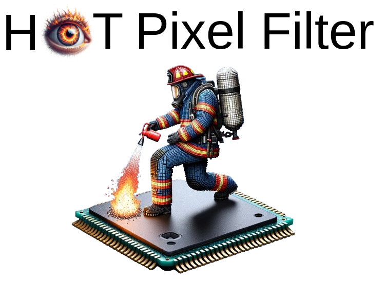

# Noise Filtering Benchmark for Neuromorphic Satellites Observations

<!-- <p align="center" width="100%">
    
</p> -->

<!-- Project page: https://samiarja.github.io/dvseventfilter/ -->


# Setup

## Requirements

- python: 3.9.x, 3.10.x

## Tested environments
- Ubuntu 22.04
- Conda 23.1.0
- Python 3.9.18

## Installation

```sh
conda create --name dvs_sparse_filter python=3.9
conda activate dvs_sparse_filter
python3 -m pip install -e .
pip install torch
pip install tqdm
pip install plotly
pip install scikit-image
pip install loris
pip install PyYAML
pip install opencv-python
pip install scikit-learn
pip install hdbscan
pip install astroquery
pip install pillow
python3 -m pip install astropy requests astrometry
python3 -m pip install scikit-image matplotlib-label-lines ipywidgets
conda install -c conda-forge pydensecrf
```


# Run

In progress...